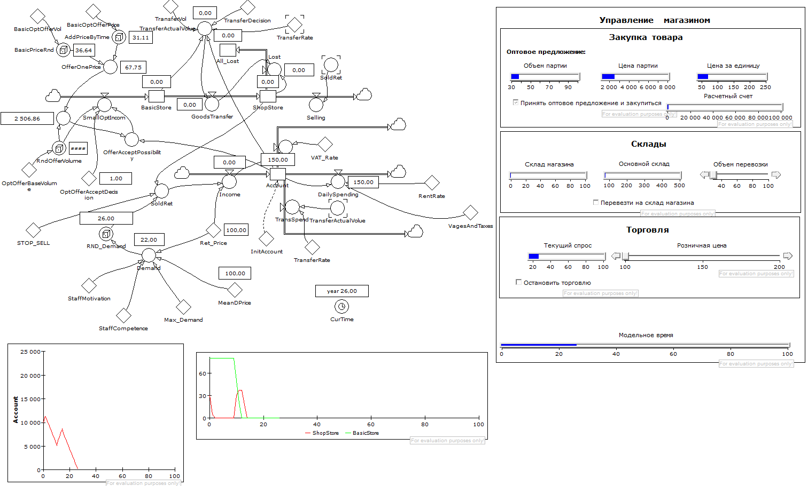
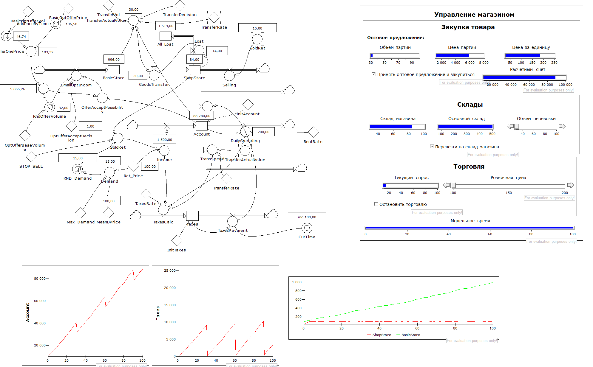
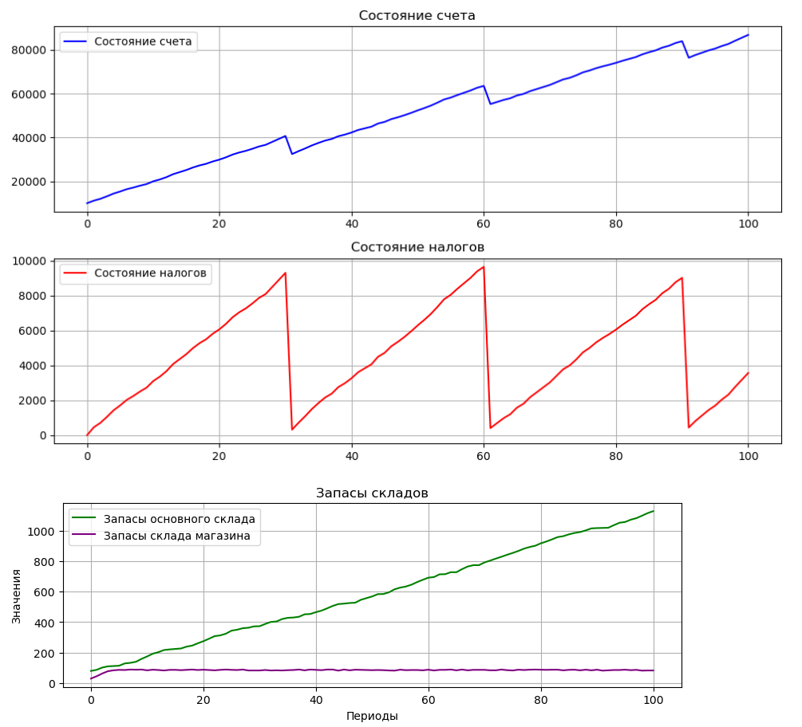

# Работа:
Системно-динамическое программирование

# Задачи:
- Внести в модель изменения так, чтобы появился еще один уровень, связанный с другими элементами модели
- Протестировать обновленную модель
- Полученную модель преобразовать в код алгоритмического языка

# Ход работы:
В качествме изменений были протестированы:
- Зависимость спроса не только от цены, но и квалификации и мотивации сотрудников:

- Налоговый учет:

Результат работы модели на алгоритмическом языке:

Значения уровней совпадают, графики ведут себя одинаково

# Заключение
В исходную модель были внесены следующие изменения:
- зависимость спроса - не требующая добавления нового уровня
- налоговый учет - добавляющий новый уровень
Был написан код на языке Python, который реализует логику, представленную на графике моделирования.
